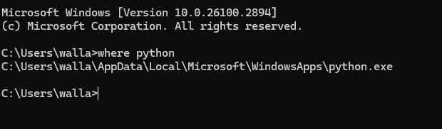

# Agendar tarefas Python no Windows

Caso você necessite agendar tarefas simples no Windows, esse tutorial tem o objetivo de mostrar o passo a passo. Vale lembrar que tarefas complexas, exigem o uso de um orquestrador, para que possa ter visibilidade completa e detalhada do fluxo. 

## Video tutorial

https://youtu.be/DQ381pccsFM


## Etapas

1 - Abra o agendador de tarefas do windows. e clique em ```criar tarefa```.


2 - Dê um nome para a tarefa e se quiser adicione uma descrição.


3 - Adicione um gatilho 


4 - Adicione um ação


Para saber onde o Python está instalado na tua máquina, podes usar o comando no CMD.

```
where python
```



5 - Cole o local onde está o interpretador do Python em ```Program/script:```

em ```Add arguments``` adicione o programa que deseja executar

Por último, faça o mapeamento da pasta onde está o script Python em ```Start in```. Se estiver usando o WSL, precisa utilizar o caminho completo, conforme eu fiz o mapeamento no vídeo tutorial. 

## Referência

https://www.youtube.com/watch?v=4n2fC97MNac&t

## Developer
| Desenvolvedor      | LinkedIn                                   | Email                        | Portfólio                              |
|--------------------|--------------------------------------------|------------------------------|----------------------------------------|
| Wallace Camargo    | [LinkedIn](https://www.linkedin.com/in/wallace-camargo-35b615171/) | wallacecpdg@gmail.com        | [Portfólio](https://wlcamargo.github.io/)   |
